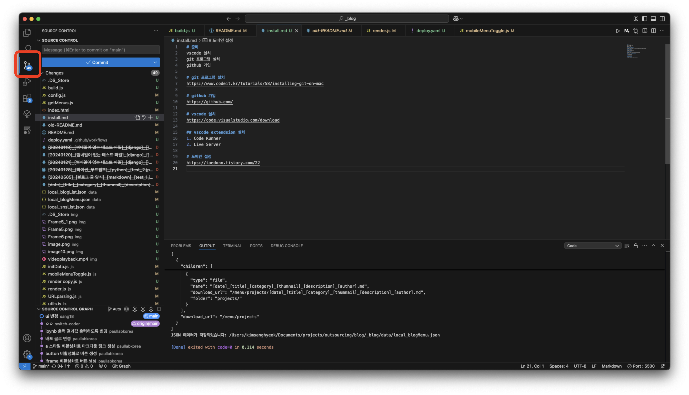
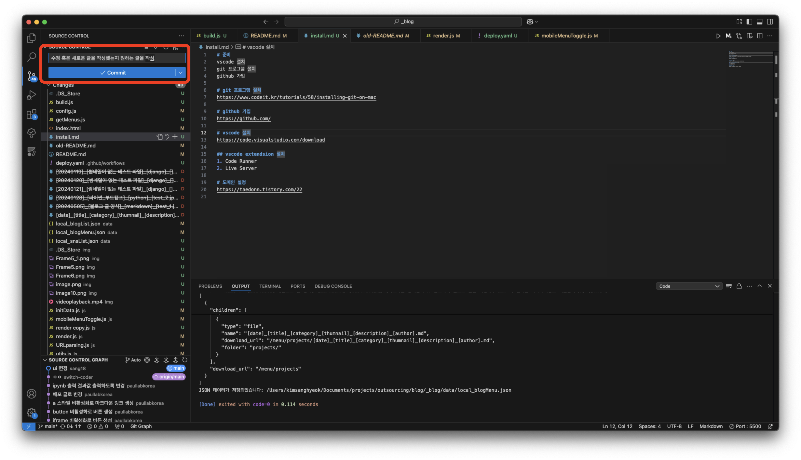
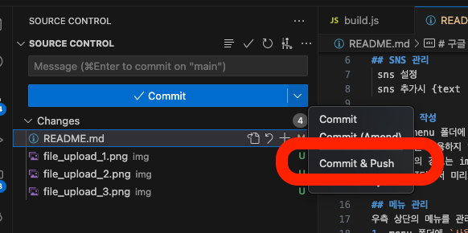
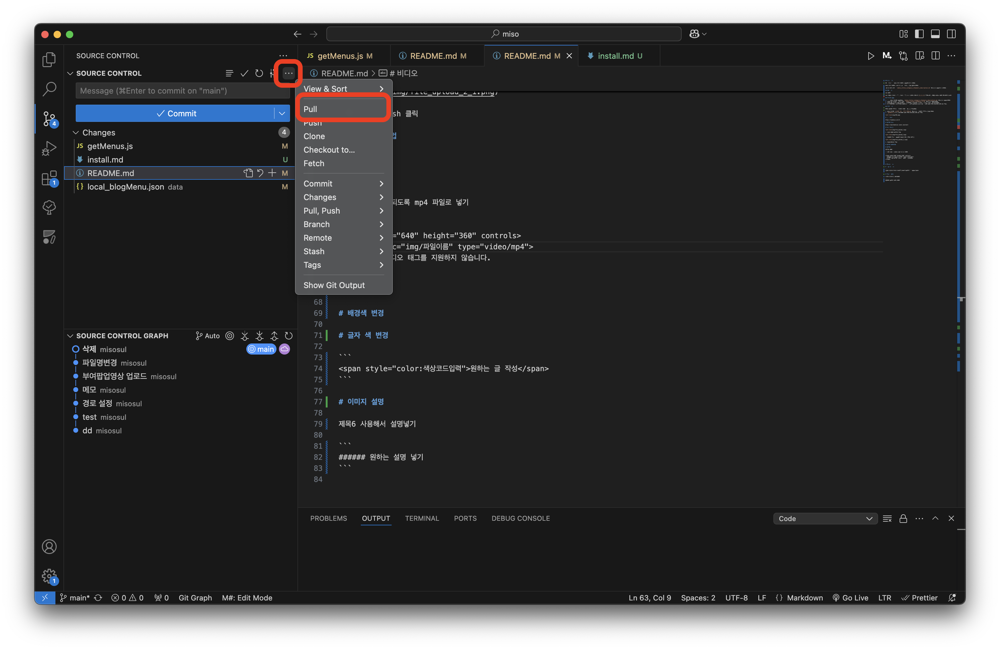

## 파일 관리

모든 게시글은 menu 폴더 안에서 작성하시면 됩니다.

menu 폴더 안에는 .md 파일 혹은 폴더만 생성 가능합니다.

.md 파일의 제목은 `[title]_[thumnail]_[description].md` 형식으로 작성해야 합니다.

## SNS 관리

sns 설정

sns 추가시 {text : "" , link : ""} <--- 여기를 복사해 [{},{},{}] 이런식의 구조가 되도록 아래 붙여넣어주세요

## 블로그 작성

1. 글은 menu 폴더에 작성하며, `[title]_[thumnail]_[description].md` 형식으로 작성합니다.
2. 썸네일을 사용하지 않는 경우, `[title]_[]_[description].md` 형식으로 작성합니다.
3. 썸네일의 경로는 img 폴더에서 관리하거나 퍼블리싱 된 이미지 링크를 사용할 수 있습니다.
4. 내 컴퓨터에서 미리보기(테스트)를 할 경우 getMenus.js파일을 선택후 상단 우측 Run(실행)버튼을 클릭.

## 메뉴 관리

우측 상단의 메뉴를 관리하는 방법은 다음과 같습니다.

1. menu 폴더에 `사용하고싶은 메뉴 이름.md` 형식으로 저장하면 메뉴로 생성됩니다.
2. `getMenus.js`파일 들어간후 상단 우측 Run(실행 / 재생버튼 모양)버튼을 클릭.

# 구글 등록

https://limetea.co.kr/8

# 네이버 등록

https://searchadvisor.naver.com/start

# 파일 업로드



1. 좌측 3번째 아이콘 클릭



2. 박스에 메시지 작성후 Commit 버튼 우측 화살표



3. Commit&Push 클릭

# 도메인 설정방법

# 비디오

비디오 넣기

- 주의 사항 : 되도록 mp4 파일로 넣기

```
<video width="640" height="360" controls>
  <source src="img/파일이름" type="video/mp4">
  브라우저가 비디오 태그를 지원하지 않습니다.
</video>

```

# 배경색 변경

style 폴더안에 style.css 파일을 열어주세요.

:root 쪽 background-color와 color를 변경해주세요

# 글자 색 변경

```
<span style="color:색상코드입력">원하는 글 작성</span> 
```
*html컬러차트 cmyk to hex 코드로 

# 이미지 설명

제목6 사용해서 설명넣기

```
###### 원하는 설명 넣기
```

# 개발사항이 변경됐을 때



1. 현재 변경중인 내용이 있다면 변경 완료한 후 파일 업로드까지 해줍니다. \* 꼭 업로드 후 다음 차례를 해야합니다.
2. ​왼쪽 3번째 아이콘 클릭 후 사진과 같이 PULL 버튼을 눌러 업데이트 해줍니다.

# 도메인 설정 방법

https://taedonn.tistory.com/22
